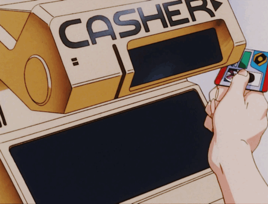

# 🎰 Taipei EasyCard ATM & Double-Entry Ledger Engine

<div align="center">


**An interactive, anime cyberpunk-inspired Taipei EasyCard ATM Terminal & Double-Entry Accounting Engine**

[Features](#-features) • [Demo](#-demo) • [Installation](#-installation) • [API](#-api-endpoints) • [Contributing](#-contributing)

</div>

---



Designed for **Player CHHAVI**, this application combines tactile hardware interactions (physical card slot insertion, thermal paper receipt printing with drag-to-tear animations, Web Audio synthesized sound effects) with a **mathematically rigorous double-entry bookkeeping engine, built on the same accounting principles GAAP sits on top of**.

---
## Live site 
- https://online-ledger.vercel.app/

## ✨ Features

### 🎮 Interactive ATM Experience
- **Physical Card Insertion**: Drag your EasyCard into the illuminated card reader slot
- **Thermal Receipt Printing**: Watch receipts print with realistic animations
- **Drag-to-Tear**: Physically tear off receipts with satisfying audio feedback
- **Web Audio Synthesis**: Zero-dependency sound effects (card swipe, printer, paper tear, clicks)

### 📊 Double-Entry Accounting Engine
- **GAAP-Compliant**: Built on the same accounting principles as professional bookkeeping
- **Automatic Categorization**: Longest-match keyword algorithm for smart expense categorization
- **Trial Balance Verification**: Ensures debits always equal credits (Δ < 0.001)
- **Roommate IOU Tracking**: Track fronted expenses and one-click reimbursement settlements

### 🎨 Cyberpunk UI/UX
- **Anime Night Market Theme**: Immersive Taipei cyberpunk aesthetic
- **Animated Intro Screen**: Flying credit card 3D orbit animation
- **HUD Navigation**: Player stats drawer with level progression
- **Responsive Design**: Works on desktop and mobile devices

### 🔧 Technical Highlights
- **TypeScript**: Full type safety across the codebase
- **React 19**: Latest React features and performance
- **Vite 6**: Lightning-fast HMR and optimized builds
- **Express API**: RESTful endpoints with idempotency protection
- **JSON Database**: Atomic file-based storage with write locks


---

## 🚀 Installation

### Prerequisites
- Node.js 18+ 
- npm or yarn

### Clone the Repository
```bash
git clone https://github.com/chhaavii/online-ledger.git
cd online-ledger-
```

### Install Dependencies
```bash
npm install
```

### Environment Setup
```bash
cp .env.example .env
# Edit .env with your configuration if needed
```

### Start Development Server
```bash
npm run dev
```
The application will be available at `http://localhost:3000`

---

## 🛠️ Development

```bash
# Start development server (Port 3000 with Express + Vite)
npm run dev

# Run TypeScript type check
npm run lint

# Build production bundle (Vite frontend + esbuild server bundle)
npm run build

# Start production server
npm run start

# Clean build artifacts
npm run clean
```

---

## 📁 Directory & File Structure

```text
├── server/
│   └── dataStore.ts           # JSON file-based database store with write locks & idempotency
├── server.ts                  # Express 5 server with API routes & Vite middleware
├── src/
│   ├── assets/                # Background image assets
│   ├── components/
│   │   ├── AtmMachine.tsx             # Interactive physical ATM terminal & thermal printer dispenser
│   │   ├── BarcodeStrip.tsx           # Category spectral barcode visualization
│   │   ├── IntroScreen.tsx            # Anime cyberpunk intro splash screen & startup animation
│   │   ├── KeywordManagerModal.tsx    # Keyword auto-categorization manager & live playground
│   │   ├── ReceiptCard.tsx            # Reusable thermal receipt card item component
│   │   ├── RoommateIouPanel.tsx       # Roommate fronted expense & IOU settlement tracker
│   │   ├── Sidebar.tsx                # HUD navigation menu & player stats drawer
│   │   ├── StatsOverview.tsx          # Key metrics summary dashboard cards
│   │   ├── TransactionRoll.tsx        # Continuous thermal receipt roll transaction history
│   │   └── TrialBalanceModal.tsx      # Double-entry trial balance modal
│   ├── utils/
│   │   └── audioEffects.ts            # Web Audio API sound synthesizer (card, printer, tear, clicks)
│   ├── App.tsx                        # Main application layout, state manager & router
│   ├── index.css                      # Global Tailwind CSS stylesheet
│   ├── ledgerEngine.ts                # Double-entry calculation & keyword matching logic
│   ├── main.tsx                       # React application DOM root entry point
│   └── types.ts                       # Shared TypeScript interface & type definitions
├── data/
│   └── db.json                        # Local persistent JSON database file (auto-initialized)
├── .env.example                       # Environment variable definitions
├── metadata.json                      # Application metadata & frame permissions
├── package.json                       # Dependencies & build scripts
├── tsconfig.json                      # TypeScript configuration
└── vite.config.ts                     # Vite build configuration
```

---

## ⚙️ Core Modules & Functions Documentation

### 1. Double-Entry Accounting Ledger (`src/ledgerEngine.ts`)

* **`categorizeDescription(desc: string, keywords: KeywordPair[]): string`**
  * **Strategy:** Longest-Keyword Match First.
  * **Logic:** Sorts all rule keywords by length descending before checking containment. Ensures specific phrases like `"night market"` match `"Dining Out"` before shorter generic keywords like `"market"` match `"Groceries"`.
  * **Fallback:** Returns `"General"` if no rule matches.

* **`computeLedger(transactions: Transaction[]): LedgerSummary`**
  * Calculates balanced double-entry ledger entries following standard debit/credit bookkeeping rules:
    * **Personal Spend (`Mine`):**
      * Debit: `Expense:{Category}`
      * Credit: `Cash`
    * **Roommate Fronted (`Roommate`):**
      * Debit: `Roommate Receivable`
      * Credit: `Cash`
    * **Roommate Reimbursement Settled (`reimbursed = true`):**
      * Debit: `Cash`
      * Credit: `Roommate Receivable`
  * **Returns:** Sum of total debits, total credits, account balances, equilibrium verification status ($\Delta < 0.001$), and spending metrics.

---

### 2. Express Backend & Data Store (`server.ts` & `server/dataStore.ts`)

* **`initDB()` / `readDB()` / `writeDB(data)`**
  * Manages persistent atomic JSON storage at `data/db.json`. Initializes default keywords (e.g., 7-Eleven, MRT, YouBike, PX Mart) and default sample transactions if the file does not exist.

* **`addTransaction(txData)`**
  * Validates transaction inputs, checks for duplicate submissions using `idempotencyKey`, appends new transaction with generated UUIDs, updates keywords, and persists changes.

* **`updateTransaction(id, updates)`**
  * Supports partial updates (e.g. toggling `reimbursed` status or modifying `category`).

* **`deleteTransaction(id)`**
  * Removes a transaction by ID and updates `data/db.json`.

#### REST API Endpoints:
| Endpoint | Method | Description |
| :--- | :--- | :--- |
| `/api/transactions` | `GET` | Fetches all recorded transactions sorted chronologically. |
| `/api/transactions` | `POST` | Records a new transaction with idempotency protection. |
| `/api/transactions/:id` | `PATCH` | Updates a transaction (e.g., toggle reimbursement). |
| `/api/transactions/:id` | `DELETE` | Deletes a transaction from the ledger. |
| `/api/keywords` | `GET` | Retrieves all auto-categorization keyword rules. |
| `/api/keywords` | `PUT` | Updates keyword rules array. |
| `/api/ledger` | `GET` | Computes and returns full double-entry ledger trial balance data. |
| `/api/health` | `GET` | Server health check endpoint. |

---

### 3. Frontend Components (`src/components/`)

* **`AtmMachine.tsx`**
  * **Tactile Card Insertion:** Features a physical EasyCard that users can click or hold & drag upwards into the illuminated card reader slot. Supports card ejection and insertion states.
  * **Thermal Receipt Dispenser:** Animates thermal paper feeding downwards upon transaction entry. Users can **hold & drag the printed receipt sideways** or click "TEAR OFF RECEIPT" to physically tear off the paper with tearing audio.
  * **ATM Terminal Screen:** Displays active inputs, auto-detected category badges, date pickers, amount fields, and owner selection (`Mine` vs `Roommate`).

* **`TransactionRoll.tsx`**
  * Renders transaction history as a continuous, stacked thermal paper roll. Provides category filtering, search bar, reimbursement settlement toggle, and item deletion.

* **`BarcodeStrip.tsx`**
  * Displays personal category spend as an interactive barcode strip and spectral progress bar breakdown. Hovering over barcode lines highlights corresponding expense categories.

* **`RoommateIouPanel.tsx`**
  * Tracks expenses fronted for roommates. Calculates current total receivable balances and provides one-click settlement buttons.

* **`TrialBalanceModal.tsx`**
  * Shows double-entry ledger balances and a trial-balance verification banner ($\text{Debits} = \text{Credits}$), account net balances, and itemized debit/credit journal entries.

* **`KeywordManagerModal.tsx`**
  * Rule editor allowing users to add, search, or delete keyword-to-category rules. Includes an interactive live matching test playground.

* **`IntroScreen.tsx`**
  * Anime Taipei cyberpunk street splash screen with startup animations and sound toggle controls.

* **`Sidebar.tsx`**
  * HUD navigation panel with player level status, audio controls, and view router.

---

### 4. Audio Effects Synthesizer (`src/utils/audioEffects.ts`)

Uses the browser's native **Web Audio API** (`AudioContext`) to generate zero-dependency audio:
* **`playCardInsertSound()`**: Dual-frequency sine sweep simulating physical magnetic card slide.
* **`playPrintReceiptSound()`**: Pulsed high-frequency square wave simulating thermal dot-matrix printing whirrs.
* **`playPaperTearSound()`**: Bandpass-filtered white noise burst simulating physical paper friction and paper tearing.
* **`playClickSound()`**: Short high-frequency sine click for button feedback.

---

## � API Endpoints

### Transactions
| Endpoint | Method | Description | Request Body |
| :--- | :--- | :--- | :--- |
| `/api/transactions` | `GET` | Fetch all transactions chronologically | - |
| `/api/transactions` | `POST` | Create new transaction | `{ date, amount, desc, whose, category, idempotencyKey }` |
| `/api/transactions/:id` | `PATCH` | Update transaction | `{ reimbursed?, category?, desc? }` |
| `/api/transactions/:id` | `DELETE` | Delete transaction | - |

### Keywords
| Endpoint | Method | Description | Request Body |
| :--- | :--- | :--- | :--- |
| `/api/keywords` | `GET` | Get all categorization rules | - |
| `/api/keywords` | `PUT` | Update keyword rules | `[[keyword, category], ...]` |

### Ledger
| Endpoint | Method | Description |
| :--- | :--- | :--- |
| `/api/ledger` | `GET` | Get trial balance & account summaries |
| `/api/health` | `GET` | Server health check |

---

## 🧮 Double-Entry Accounting Logic

The ledger engine follows GAAP-compliant double-entry bookkeeping:

### Personal Expenses (`Mine`)
```
Debit:  Expense:{Category}
Credit: Cash
```

### Roommate Fronted Expenses (`Roommate`)
```
Debit:  Roommate Receivable
Credit: Cash
```

### Reimbursement Settlement
```
Debit:  Cash
Credit: Roommate Receivable
```

### Trial Balance
The system automatically verifies that total debits equal total credits within floating-point tolerance (Δ < 0.001).

---

## 🎯 Usage Examples

### Adding a Transaction
```typescript
const response = await fetch('/api/transactions', {
  method: 'POST',
  headers: { 'Content-Type': 'application/json' },
  body: JSON.stringify({
    date: '2024-01-15',
    amount: 150,
    desc: '7-Eleven lunch',
    whose: 'Mine',
    category: 'Dining Out',
    idempotencyKey: 'unique-key-123'
  })
});
```

### Auto-Categorization
```typescript
import { categorizeDescription } from './ledgerEngine';

const keywords = [
  ['7-Eleven', 'Groceries'],
  ['night market', 'Dining Out']
];

const category = categorizeDescription('night market snacks', keywords);
// Returns: 'Dining Out' (longest match wins)
```

---

## 🤝 Contributing

Contributions are welcome! Please follow these steps:

1. Fork the repository
2. Create a feature branch (`git checkout -b feature/amazing-feature`)
3. Commit your changes (`git commit -m 'Add amazing feature'`)
4. Push to the branch (`git push origin feature/amazing-feature`)
5. Open a Pull Request

### Development Guidelines
- Follow the existing code style (TypeScript, Prettier)
- Add comments for complex logic
- Test thoroughly before submitting
- Update documentation as needed

---

## 📝 License

This project is open source and available under the [MIT License](LICENSE).

---

## 👤 Author

**Made by Chhavi** 😊

- GitHub: [@chhaavii](https://github.com/chhaavii)
- Project Link: [https://github.com/chhaavii/online-ledger](https://github.com/chhaavii/online-ledger)

---

## 🙏 Acknowledgments

- Inspired by Taipei's night market culture and EasyCard system
- Built with modern web technologies (React, Vite, TypeScript)
- Double-entry accounting principles based on GAAP standards

---

## 📞 Support

If you encounter any issues or have questions:
- Open an issue on GitHub
- Check the existing documentation
- Review the API endpoints section

---

<div align="center">

**⭐ If you like this project, please give it a star! ⭐**

Made with ❤️ by Chhavi

</div>
